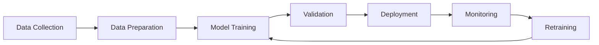

# Full-Stack AI Apps Architecture

## Overview

This document outlines the comprehensive architecture for deploying AI applications across multiple cloud platforms with integrated MLOps, RAG, AI agents, and MCP support.

## Architecture Diagram

```mermaid
graph TB
    Client[Client Applications] --> LB[Load Balancer]
    LB --> API[API Gateway]
    
    API --> Auth[Authentication Service]
    API --> RAG[RAG System]
    API --> Agents[AI Agents]
    API --> MCP[MCP Server]
    
    subgraph "Cloud Platforms"
        AWS[Amazon Web Services]
        GCP[Google Cloud Platform]
        Azure[Microsoft Azure]
        Vercel[Vercel Edge Runtime]
    end
    
    subgraph "AWS Services"
        AWS --> Bedrock[Amazon Bedrock]
        AWS --> SageMaker[Amazon SageMaker]
        AWS --> Lambda[AWS Lambda]
        AWS --> ECS[Amazon ECS]
    end
    
    subgraph "GCP Services"
        GCP --> VertexAI[Vertex AI]
        GCP --> CloudRun[Cloud Run]
        GCP --> GKE[Google Kubernetes Engine]
    end
    
    subgraph "Azure Services"
        Azure --> AzureOpenAI[Azure OpenAI]
        Azure --> CognitiveServices[Cognitive Services]
        Azure --> AKS[Azure Kubernetes Service]
    end
    
    subgraph "Data Layer"
        VectorDB[Vector Databases]
        RelationalDB[PostgreSQL]
        CacheDB[Redis]
        ObjectStorage[Object Storage]
    end
    
    subgraph "Monitoring & Observability"
        Prometheus[Prometheus]
        Grafana[Grafana]
        Logs[Centralized Logging]
        Tracing[Distributed Tracing]
    end
    
    RAG --> VectorDB
    Agents --> VectorDB
    MCP --> RelationalDB
    API --> CacheDB
    
    All Services --> Monitoring & Observability
```

## Core Components

### 1. API Gateway Layer

**Purpose**: Centralized entry point for all AI services
**Technologies**: FastAPI (Python), Express.js (Node.js)
**Features**:
- Request routing and load balancing
- Authentication and authorization
- Rate limiting and throttling
- Request/response transformation
- Caching layer

### 2. RAG (Retrieval Augmented Generation) System

**Purpose**: Enhanced AI responses using vector search and external knowledge
**Components**:
- **Embedding Service**: Text vectorization using models like `all-MiniLM-L6-v2`
- **Vector Databases**: Pinecone, Chroma, Weaviate for similarity search
- **Document Processing**: Ingestion and chunking of documents
- **Retrieval Engine**: Semantic search and ranking
- **Generation Service**: LLM integration for response generation

```python
# RAG Architecture Flow
Document → Chunking → Embedding → Vector Store
Query → Embedding → Similarity Search → Context Retrieval → LLM → Response
```

### 3. Model Context Protocol (MCP)

**Purpose**: Standardized AI model interaction protocol
**Features**:
- Multi-model orchestration
- Context management and persistence
- Tool integration and function calling
- Cross-platform compatibility

**MCP Message Format**:
```json
{
  "id": "request-id",
  "type": "request",
  "method": "textGeneration/generate",
  "params": {
    "prompt": "Generate a summary",
    "model": "gpt-4",
    "max_tokens": 1000
  }
}
```

### 4. AI Agents System

**Purpose**: Autonomous AI agents for complex task execution
**Types**:
- **Conversational Agents**: Chat and dialogue management
- **Task Agents**: Multi-step workflow execution
- **Analysis Agents**: Data analysis and insights
- **Decision Agents**: Autonomous decision making

**Agent Architecture**:
```
Agent Controller → Planning → Tool Selection → Execution → Validation → Response
```

### 5. Multi-Cloud Infrastructure

#### AWS Integration
- **Amazon Bedrock**: Foundation models (Claude, Llama, Titan)
- **SageMaker**: Custom model training and deployment
- **Lambda**: Serverless AI functions
- **ECS/EKS**: Containerized AI services
- **S3**: Model artifacts and data storage
- **CloudWatch**: Monitoring and logging

#### GCP Integration
- **Vertex AI**: ML model deployment and management
- **Cloud Run**: Serverless containers
- **GKE**: Kubernetes orchestration
- **Cloud Storage**: Data and model storage
- **Cloud Monitoring**: Observability

#### Azure Integration
- **Azure OpenAI**: GPT and other OpenAI models
- **Cognitive Services**: Pre-built AI services
- **AKS**: Kubernetes services
- **Blob Storage**: Data storage
- **Application Insights**: Monitoring

#### Vercel Integration
- **Edge Runtime**: Global edge deployment
- **Serverless Functions**: API endpoints
- **KV Store**: Edge data storage
- **Analytics**: Performance monitoring

## Data Architecture

### Vector Database Strategy

**Multi-Database Approach**:
- **Pinecone**: Production-scale vector search
- **Chroma**: Open-source local development
- **Weaviate**: Knowledge graphs and semantic search

**Data Flow**:
```
Raw Documents → Text Extraction → Chunking → Embedding Generation → Vector Storage
Query → Embedding → Similarity Search → Ranked Results → Context Assembly
```

### Traditional Database Layer

**PostgreSQL Schema**:
```sql
-- Users and authentication
CREATE TABLE users (
    id UUID PRIMARY KEY,
    email VARCHAR(255) UNIQUE,
    created_at TIMESTAMP DEFAULT NOW()
);

-- Chat sessions
CREATE TABLE chat_sessions (
    id UUID PRIMARY KEY,
    user_id UUID REFERENCES users(id),
    title VARCHAR(255),
    created_at TIMESTAMP DEFAULT NOW()
);

-- Messages
CREATE TABLE messages (
    id UUID PRIMARY KEY,
    session_id UUID REFERENCES chat_sessions(id),
    content TEXT,
    is_user_message BOOLEAN,
    metadata JSONB,
    created_at TIMESTAMP DEFAULT NOW()
);

-- RAG documents
CREATE TABLE documents (
    id UUID PRIMARY KEY,
    title VARCHAR(255),
    content TEXT,
    source VARCHAR(255),
    metadata JSONB,
    created_at TIMESTAMP DEFAULT NOW()
);
```

### Caching Strategy

**Redis Usage**:
- Session management
- API response caching
- Rate limiting counters
- Temporary data storage
- Real-time features (WebSocket sessions)

## Security Architecture

### Authentication & Authorization

**JWT-based Authentication**:
```javascript
{
  "sub": "user-id",
  "iat": 1640995200,
  "exp": 1641081600,
  "scope": ["read:ai", "write:chat"],
  "provider": "oauth2"
}
```

**Role-Based Access Control (RBAC)**:
- **Admin**: Full system access
- **Developer**: API and model management
- **User**: Standard AI services access
- **Guest**: Limited read-only access

### Data Protection

**Encryption**:
- At rest: AES-256 encryption for databases
- In transit: TLS 1.3 for all communications
- Application: Field-level encryption for sensitive data

**Privacy**:
- PII detection and masking
- Data retention policies
- GDPR compliance features
- Audit logging

## MLOps Architecture

### Model Lifecycle Management



**Components**:
- **MLflow**: Experiment tracking and model registry
- **DVC**: Data version control
- **Kubeflow**: Kubernetes-native ML workflows
- **Airflow**: Data pipeline orchestration

### Model Deployment Strategies

**Multi-Cloud Deployment**:
- **Blue-Green**: Zero-downtime deployments
- **Canary**: Gradual rollout with traffic splitting
- **A/B Testing**: Model performance comparison
- **Shadow**: Risk-free production testing

## Monitoring & Observability

### Metrics Collection

**Application Metrics**:
```python
# Custom metrics with Prometheus
from prometheus_client import Counter, Histogram, Gauge

request_count = Counter('http_requests_total', 'Total HTTP requests', ['method', 'endpoint'])
request_duration = Histogram('http_request_duration_seconds', 'HTTP request duration')
active_users = Gauge('active_users_total', 'Number of active users')
```

**AI-Specific Metrics**:
- Model inference latency
- Token usage and costs
- RAG retrieval accuracy
- Agent task completion rates
- Vector search performance

### Alerting Rules

**Prometheus Alerting**:
```yaml
groups:
  - name: ai-apps
    rules:
      - alert: HighErrorRate
        expr: rate(http_requests_total{status=~"5.."}[5m]) > 0.1
        for: 2m
        labels:
          severity: critical
        annotations:
          summary: High error rate detected
      
      - alert: SlowRAGQueries
        expr: histogram_quantile(0.95, rate(rag_query_duration_seconds_bucket[5m])) > 5
        for: 5m
        labels:
          severity: warning
        annotations:
          summary: RAG queries are slow
```

### Distributed Tracing

**OpenTelemetry Integration**:
```python
from opentelemetry import trace
from opentelemetry.exporter.jaeger.thrift import JaegerExporter

tracer = trace.get_tracer(__name__)

@tracer.start_as_current_span("rag_query")
async def query_rag(query: str):
    span = trace.get_current_span()
    span.set_attribute("query.length", len(query))
    # ... RAG logic
    span.set_attribute("results.count", len(results))
    return results
```

## Performance Optimization

### Caching Strategies

**Multi-Level Caching**:
1. **Application Cache**: In-memory caching for frequently accessed data
2. **Redis Cache**: Distributed caching for API responses
3. **CDN Cache**: Edge caching for static assets and API responses
4. **Database Query Cache**: Query result caching

### Horizontal Scaling

**Auto-scaling Configuration**:
```yaml
apiVersion: autoscaling/v2
kind: HorizontalPodAutoscaler
metadata:
  name: ai-app-hpa
spec:
  scaleTargetRef:
    apiVersion: apps/v1
    kind: Deployment
    name: ai-app
  minReplicas: 2
  maxReplicas: 10
  metrics:
  - type: Resource
    resource:
      name: cpu
      target:
        type: Utilization
        averageUtilization: 70
  - type: Resource
    resource:
      name: memory
      target:
        type: Utilization
        averageUtilization: 80
```

## Disaster Recovery & High Availability

### Multi-Region Setup

**Region Distribution**:
- **Primary**: US-East (AWS us-east-1, GCP us-central1, Azure East US)
- **Secondary**: Europe (AWS eu-west-1, GCP europe-west1, Azure West Europe)
- **DR**: Asia Pacific (AWS ap-southeast-1, GCP asia-southeast1, Azure Southeast Asia)

### Backup Strategy

**Data Backup**:
- **Databases**: Daily automated backups with point-in-time recovery
- **Vector Stores**: Weekly full backups with incremental daily updates
- **Model Artifacts**: Versioned storage with immutable references
- **Configuration**: Git-based version control with automated deployments

## Cost Optimization

### Resource Management

**Auto-scaling Policies**:
- CPU-based scaling for compute workloads
- Memory-based scaling for data processing
- Queue-based scaling for async processing
- Time-based scaling for predictable workloads

**Cost Monitoring**:
```python
# AWS Cost tracking
import boto3
ce = boto3.client('ce')

def get_monthly_costs():
    response = ce.get_cost_and_usage(
        TimePeriod={'Start': '2023-01-01', 'End': '2023-01-31'},
        Granularity='MONTHLY',
        Metrics=['BlendedCost'],
        GroupBy=[{'Type': 'DIMENSION', 'Key': 'SERVICE'}]
    )
    return response['ResultsByTime']
```

## Future Roadmap

### Planned Enhancements

1. **Advanced AI Features**:
   - Multi-modal AI (text, image, audio)
   - Fine-tuned custom models
   - Federated learning capabilities

2. **Enhanced Security**:
   - Zero-trust architecture
   - Advanced threat detection
   - Homomorphic encryption

3. **Performance Improvements**:
   - Edge AI deployment
   - Model quantization and optimization
   - Advanced caching strategies

4. **Developer Experience**:
   - Low-code AI platform
   - Visual workflow builder
   - Automated testing and validation